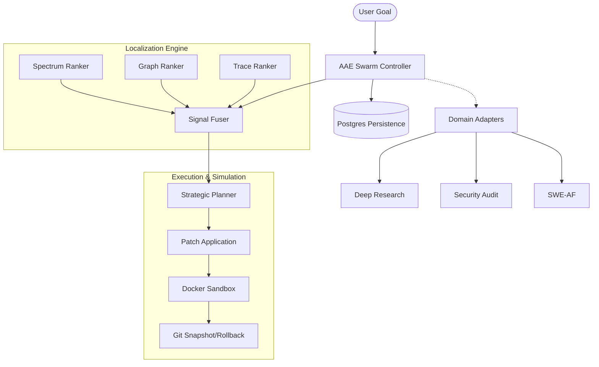

# AI Autonomous Engineering (AAE) 🚀

> A production-grade, autonomous software engineering factory for large-scale codebase maintenance, security hardening, and self-healing.

[](#installation)
[](#architecture)
[](LICENSE)
[](#persistence--state-management)

AAE is a sophisticated orchestration platform that unifies research, security auditing, and autonomous software engineering. It moves beyond simple "one-shot" patching into a high-fidelity **localized repair** and **simulated validation** ecosystem.

---

## Key Capabilities

### Advanced Localization Subsystem

Precisely identifies the root cause of failures across millions of lines of code using a multi-signal fusion engine:

- **Spectrum-Based Ranking**: Analyzes line-level test coverage and execution density.
- **Graph Proximity Ranking**: Navigates the codebase's symbol dependency graph to find logical neighbors.
- **Trace Analysis**: Utilizes actual runtime execution traces for pinpoint accuracy.
- **AST Span Extraction**: Automatically isolates the minimal relevant code blocks for LLM reasoning.

### Robust Patch Application

High-reliability code modification with defensive guardrails:

- **Iterative Repair Loop**: Performs multi-stage patching with automatic feedback and validation.
- **LLM Consensus Engine**: Uses senior-architect-level LLM reasoning to rank and select the best candidate plans.
- **Action-Tree Planning**: Dynamically decomposes complex goals into granular, safe modifications.

### Persistence and State Management

LangGraph-inspired state checkpointing for reliable long-running autonomous tasks:

- **Thread-Level Persistence**: Fully persistent state stored in PostgreSQL (`aae_checkpoints`).
- **Sandbox Snapshots**: Git-based workspace checkpointing and instant rollback for safe patch simulation.
- **Trajectory Logs**: Detailed event-sourced execution logs in JSONL format for replayability and analysis.

---

## System Architecture

AAE coordinates specialized agent systems through a unified control plane:



---

## Project Structure

| Component | Responsibility |
| :--- | :--- |
| **`src/aae/localization`** | Multi-signal fault localization and span extraction. |
| **`src/aae/planner`** | Strategic decision making and candidate plan ranking. |
| **`src/aae/persistence`** | PostgreSQL-backed state storage and thread management. |
| **`src/aae/sandbox`** | Dockerized execution with Git-based snapshotting. |
| **`src/aae/agents`** | Core micro-agent implementations (Orchestrators, Judges). |
| **`src/aae/contracts`** | Pydantic models defining the cross-system protocol. |

---

## Getting Started

### Prerequisites

- **Python**: 3.11 or higher.
- **Database**: PostgreSQL (for persistence).
- **Environment**: Docker (for sandboxed execution).

### Installation

```bash
git clone https://github.com/dawsonblock/ai_autonomous_engineering.git
cd ai_autonomous_engineering
python3.11 -m venv .venv
source .venv/bin/activate
pip install -e ".[dev]"
```

### Configuration

1. Copy `.env.example` to `.env`.
2. Configure your `OPENAI_API_KEY` and `AAE_DATABASE_URL`.
3. Tweak `configs/system_config.yaml` for custom concurrency settings.

---

## Usage

### Run a Secure Build

Compiles research, security auditing, and localized repair into one autonomous workflow:

```bash
export PYTHONPATH=src
python -m aae.runtime.system_launcher \
    --workflow secure_build \
    --goal "Harden authentication and implement audit logging" \
    --repo-url https://github.com/example/target-project.git
```

### Direct Localization

Debug a specific test failure in a repository:

```bash
python -m aae.localization.localization_service \
    --test-output path/to/failed_tests.log \
    --repo-root path/to/repo
```

---

## Roadmap

- [x] **Milestone 1**: Foundation & Cross-System Orchestration.
- [x] **Milestone 2**: Advanced Fault Localization & Graph Ranking.
- [x] **Milestone 3**: Iterative Patching & LLM-Powered Consensus.
- [x] **Milestone 4**: Persistent State Checkpointing & Sandbox Rollbacks.
- [ ] **Milestone 5**: Distributed Sandbox Worker Pools.
- [ ] **Milestone 6**: Meta-Engineering Learning Loop.

---

## Contributing

We welcome contributions! Please see our [Development Notes](./docs/DEVELOPMENT.md) for architecture details and linting standards.

---

---

Built with ❤️ by the AAE Team

- micro-agent swarm orchestration
- consensus planning
- domain-specific specialist workers

## Suggested Reading Path

If you are new to this repo, read in this order:

1. this README
2. [`src/aae/runtime/workflow_presets.py`](./src/aae/runtime/workflow_presets.py)
3. [`src/aae/controller/controller.py`](./src/aae/controller/controller.py)
4. [`src/aae/adapters`](./src/aae/adapters)
5. the bundled repo README most relevant to your domain

If you want the original future-state design context:

1. this README
2. [`FULL UPGRADE PLAN.txt`](./FULL%20UPGRADE%20PLAN.txt)

## License

The root repository now includes a license file:

- [`LICENSE`](./LICENSE)

Bundled subprojects also retain their own license files where present. Review those files directly if you plan to redistribute parts of the bundled workspace separately.
