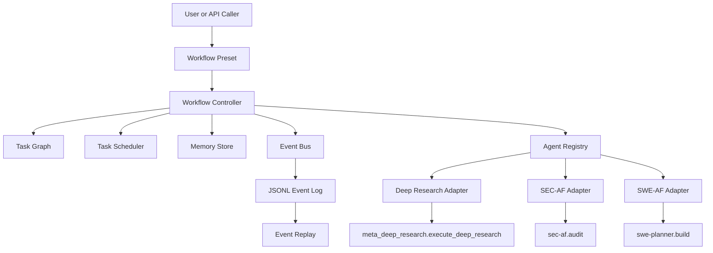

# AI Autonomous Engineering

An umbrella AI kernel for orchestrating multiple AgentField-powered systems through one asyncio runtime.

This repository does not replace the existing sibling projects. It coordinates them:

- `af-deep-research` for recursive research
- `sec-af` for security analysis
- `SWE-AF` for autonomous software engineering

Milestone 1 focuses on a stable orchestration layer:

- bounded async task scheduling
- dependency-aware workflow execution
- retry management with backoff and jitter
- structured workflow memory
- typed event emission
- JSONL event persistence and replay
- thin adapters over existing AgentField nodes

## Status

This repo currently implements the first integration milestone. It is intentionally narrow.

Included now:

- async workflow controller
- task graph and scheduler
- event bus with in-memory transport and optional Redis transport
- JSONL event log as the source of truth
- in-memory workflow memory store
- AgentField RPC adapters for research, security, and SWE
- workflow presets for `research_only`, `security_only`, `swe_only`, and `secure_build`
- unit and integration tests for the orchestration layer

Explicitly deferred:

- repository graph
- planning engine
- trajectory learning
- vector stores
- distributed sandbox workers
- micro-agent swarm subsystem

## Why This Exists

The three sibling systems already have meaningful internal orchestration:

- `SWE-AF` has the strongest DAG execution and iterative coding loop
- `SEC-AF` has a phased streaming audit orchestrator
- `af-deep-research` has dynamic research orchestration and memory hooks

What was missing was a clean outer control plane that can compose them into one higher-level workflow without rewriting their internals.

This repo provides that outer control plane.

## Architecture



## Core Concepts

### Workflow Controller

The controller owns execution of a `WorkflowSpec`.

Responsibilities:

- initialize workflow memory
- evaluate ready tasks from the graph
- dispatch tasks through adapters
- persist normalized results
- emit controller and domain events
- apply retry policy on transient failures
- unblock or block downstream tasks based on dependency outcomes

Main implementation:

- [`src/aae/controller/controller.py`](./src/aae/controller/controller.py)

### Task Graph

The task graph tracks task states explicitly:

- `pending`
- `ready`
- `running`
- `succeeded`
- `failed`
- `retry_waiting`
- `blocked`
- `cancelled`

Dependencies are hard by default. Soft dependencies are only used in optional workflow branches, such as:

- research feeding a build as optional context
- post-build security audit depending on optional earlier work

Main implementation:

- [`src/aae/controller/task_graph.py`](./src/aae/controller/task_graph.py)

### Task Scheduler

The scheduler uses an internal `asyncio.PriorityQueue` and bounded concurrency.

Current default:

- maximum concurrency: `4`

Higher-priority tasks are dispatched first. Readiness is still governed by dependency resolution in the task graph.

Main implementation:

- [`src/aae/controller/task_scheduler.py`](./src/aae/controller/task_scheduler.py)

### Retry Policy

Retries are conservative and only happen on:

- transport failures
- timeouts
- explicit transient adapter failures

Default policy:

- `max_attempts=3`
- `base_delay_s=2`
- `max_delay_s=30`
- exponential backoff with jitter

Main implementation:

- [`src/aae/controller/retry_policy.py`](./src/aae/controller/retry_policy.py)

### Event System

The event system has two jobs:

1. decouple workflow observers from execution
2. persist every event to JSONL so workflow history can be replayed

Transport:

- default: in-memory publish/subscribe
- optional: Redis pub/sub transport when `REDIS_URL` is set

Persistence:

- always JSONL
- stored at `.artifacts/events/<workflow_id>.jsonl`

Important detail:

- Redis is transport only
- JSONL remains the replay source of truth

Main implementation:

- [`src/aae/events/event_bus.py`](./src/aae/events/event_bus.py)
- [`src/aae/events/event_logger.py`](./src/aae/events/event_logger.py)
- [`src/aae/events/event_replay.py`](./src/aae/events/event_replay.py)

### Memory Model

Milestone 1 uses a run-scoped in-memory store only.

Namespace layout:

- `workflow/<workflow_id>`
- `task/<task_id>`
- `agent/<agent_name>`

This is intentionally simple. The memory contract is narrow so it can later be backed by a graph store, vector index, or durable state service without changing controller behavior.

Main implementation:

- [`src/aae/memory/base.py`](./src/aae/memory/base.py)
- [`src/aae/memory/in_memory.py`](./src/aae/memory/in_memory.py)

## Adapters

Adapters are the integration boundary between this repo and the sibling codebases.

They do three things:

1. call AgentField asynchronously
2. normalize raw outputs into stable controller-facing structures
3. emit canonical domain events

### Deep Research Adapter

Target:

- `meta_deep_research.execute_deep_research`

Normalizes:

- entity count
- relationship count
- quality score
- selected document metadata

Emits:

- `research.completed`

Implementation:

- [`src/aae/adapters/deep_research.py`](./src/aae/adapters/deep_research.py)

### SEC-AF Adapter

Target:

- `sec-af.audit`

Normalizes:

- finding summaries
- verdicts
- severity breakdown
- finding count

Emits:

- `security.vulnerability_detected`
- `security.audit_completed`

Implementation:

- [`src/aae/adapters/sec_af.py`](./src/aae/adapters/sec_af.py)

### SWE-AF Adapter

Target:

- `swe-planner.build`

Normalizes:

- completed issues
- failed issues
- changed files
- PR URLs

Emits:

- `swe.patch_generated`
- `swe.test_failed`
- `swe.build_completed`

It also injects upstream workflow context into `additional_context` for the SWE build call.

Implementation:

- [`src/aae/adapters/swe_af.py`](./src/aae/adapters/swe_af.py)

### AgentField Client

The low-level AgentField transport is implemented with `httpx.AsyncClient`.

Flow:

1. submit async execution
2. capture `execution_id`
3. poll execution status
4. unwrap final output
5. classify transport and timeout failures as retryable

Implementation:

- [`src/aae/adapters/agentfield_client.py`](./src/aae/adapters/agentfield_client.py)

## Workflow Presets

Workflow construction lives in:

- [`src/aae/runtime/workflow_presets.py`](./src/aae/runtime/workflow_presets.py)

### `research_only`

Runs only the deep research adapter.

### `security_only`

Runs only the security audit adapter.

### `swe_only`

Runs only the SWE build adapter.

### `secure_build`

This is the main composite workflow in Milestone 1.

Default flow:

1. optional research
2. baseline security audit
3. SWE build
4. optional post-build security audit

Dependency behavior:

- `security_baseline` is a hard dependency for `swe_build`
- `research` is an optional soft dependency for `swe_build`
- `security_post` is optional and only present when requested

## Event Model

Typed event envelopes are defined in:

- [`src/aae/contracts/workflow.py`](./src/aae/contracts/workflow.py)

Canonical controller event types:

- `workflow.started`
- `task.ready`
- `task.dispatched`
- `task.retry_scheduled`
- `task.succeeded`
- `task.failed`
- `task.blocked`
- `memory.updated`
- `workflow.completed`

Canonical domain event types:

- `research.completed`
- `security.vulnerability_detected`
- `security.audit_completed`
- `swe.patch_generated`
- `swe.test_failed`
- `swe.build_completed`

Declared constants:

- [`src/aae/events/event_types.py`](./src/aae/events/event_types.py)

## Project Layout

```text
ai_autonomous_engineering/
├── configs/
│   └── system_config.yaml
├── src/aae/
│   ├── adapters/
│   ├── contracts/
│   ├── controller/
│   ├── events/
│   ├── memory/
│   └── runtime/
└── tests/
    ├── integration/
    └── unit/
```

## Configuration

Default config lives in:

- [`configs/system_config.yaml`](./configs/system_config.yaml)

It defines:

- AgentField base URL
- polling interval
- request timeout
- controller concurrency
- artifact directory
- sibling repo paths
- default AgentField targets for each adapter

Example:

```yaml
agentfield:
  base_url: "http://localhost:8080"
  api_key_env: "AGENTFIELD_API_KEY"
  poll_interval_s: 1.0
  request_timeout_s: 30.0
```

## Environment Variables

Use [`.env.example`](./.env.example) as the starting point.

Supported variables:

- `AGENTFIELD_SERVER`
- `AGENTFIELD_API_KEY`
- `REDIS_URL`
- `AAE_CONFIG`

Notes:

- `REDIS_URL` is optional
- if Redis is absent, the bus falls back to in-memory mode
- the system still logs events to JSONL in either mode

## Installation

This repo targets Python `3.12+`.

```bash
python3.12 -m venv .venv
source .venv/bin/activate
python -m pip install --upgrade pip
python -m pip install -e ".[dev]"
```

## Running the Launcher

The launcher entrypoint is:

- [`src/aae/runtime/system_launcher.py`](./src/aae/runtime/system_launcher.py)

### Show CLI Help

```bash
PYTHONPATH=src python -m aae.runtime.system_launcher --help
```

### Run `research_only`

```bash
PYTHONPATH=src python -m aae.runtime.system_launcher \
  --workflow research_only \
  --query "What are the current risks in the AI chip supply chain?" \
  --config configs/system_config.yaml
```

### Run `security_only`

```bash
PYTHONPATH=src python -m aae.runtime.system_launcher \
  --workflow security_only \
  --repo-url https://github.com/example/project.git \
  --config configs/system_config.yaml
```

### Run `swe_only`

```bash
PYTHONPATH=src python -m aae.runtime.system_launcher \
  --workflow swe_only \
  --goal "Add structured audit logging to auth flows" \
  --repo-url https://github.com/example/project.git \
  --config configs/system_config.yaml
```

### Run `secure_build`

```bash
PYTHONPATH=src python -m aae.runtime.system_launcher \
  --workflow secure_build \
  --goal "Harden auth and billing flows" \
  --repo-url https://github.com/example/project.git \
  --include-research \
  --query "Find important auth and billing risks before implementation" \
  --include-post-audit \
  --config configs/system_config.yaml
```

The launcher now validates required arguments early and exits with a clear CLI error if required inputs are missing.

## Failure Behavior

The controller is designed to fail predictably.

Examples:

- AgentField unreachable: task retries and then fails with a structured transport error
- hard dependency fails: downstream hard dependents move to `blocked`
- no runnable tasks remain: unresolved pending tasks are explicitly blocked rather than left ambiguous

This means a workflow always ends in explicit terminal task states.

## Testing

Run the full test suite:

```bash
python3 -m pytest
```

Current coverage focus:

- task graph transitions
- retry policy behavior
- event logging and replay
- registry duplicate protection
- memory snapshot isolation
- adapter normalization
- secure build orchestration
- launcher argument validation

## Current Verification

At the time of writing, the local suite for this repo passes:

```bash
python3 -m pytest
```

What is verified:

- controller behavior under success and failure
- adapter normalization contracts
- event replay behavior
- launcher validation

What is not fully verified here:

- a successful live end-to-end run against real running AgentField nodes for all three sibling systems

If the control plane is not running, the launcher will still produce a structured failure result and write the workflow event log.

## Design Principles

This repo is intentionally conservative.

- Keep subsystem boundaries explicit
- Normalize at the adapter layer, not inside sibling repos
- Persist event history even when transport is ephemeral
- Keep controller contracts narrow so later storage and planning upgrades are easy
- Prefer typed, replayable workflow state over prompt-only orchestration

## Roadmap

Planned next layers after Milestone 1:

1. repository graph and graph query APIs
2. planning engine and branch simulation
3. trajectory analysis and policy learning
4. persistent multi-layer memory backends
5. distributed sandbox execution
6. micro-agent swarm orchestration

## Relationship to Sibling Repositories

This repo assumes the following sibling layout:

```text
FULL _ENGINEER/
├── ai_autonomous_engineering/
├── af-deep-research-main/
├── sec-af-main/
└── SWE-AF-main/
```

They remain external codebases in Milestone 1.

This repo does not vendor them, rewrite them, or absorb their internal logic.

## License

No separate license file has been added in this milestone yet. If you plan to publish the repository, add the intended license explicitly before release.
