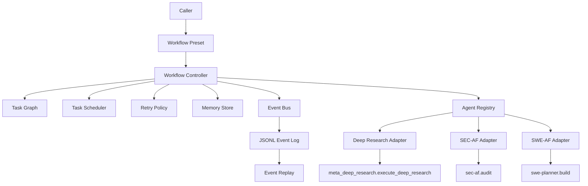
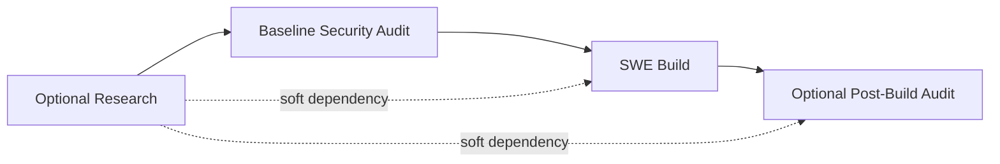

# AI Autonomous Engineering

> A bundled engineering workspace for building a unified AI-native software factory on top of existing AgentField systems.

[](#installation)
[](#current-state)
[](#architecture)
[](#workflow-presets)

This repository is the integration point for four moving pieces:

- a new umbrella orchestration layer in [`src/aae`](./src/aae)
- a vendored snapshot of [`af-deep-research-main`](./af-deep-research-main)
- a vendored snapshot of [`sec-af-main`](./sec-af-main)
- a vendored snapshot of [`SWE-AF-main`](./SWE-AF-main)

The goal is not to flatten those systems into one codebase immediately. The goal is to create a stable control plane around them first, then evolve toward a deeper unified platform in later milestones.

## Table Of Contents

- [What This Repository Is](#what-this-repository-is)
- [Current State](#current-state)
- [Architecture](#architecture)
- [Workspace Layout](#workspace-layout)
- [Umbrella Runtime](#umbrella-runtime)
- [Workflow Presets](#workflow-presets)
- [Adapters](#adapters)
- [Contracts](#contracts)
- [Event System](#event-system)
- [Memory Model](#memory-model)
- [Configuration](#configuration)
- [Installation](#installation)
- [Running The Platform](#running-the-platform)
- [Running Bundled Systems Directly](#running-bundled-systems-directly)
- [Testing](#testing)
- [Development Notes](#development-notes)
- [Current Limitations](#current-limitations)
- [Roadmap](#roadmap)

## What This Repository Is

This repository is a platform workspace, not just a single package.

It contains:

- the new umbrella AI kernel that coordinates tasks across multiple agent systems
- the three source repositories that the kernel currently calls through adapters
- the original upgrade plan used to shape the long-term direction of the platform

That makes this repo useful in two ways:

1. You can work on the integration runtime itself.
2. You can inspect and evolve the bundled upstream systems in the same workspace.

The umbrella layer currently speaks to the bundled systems through AgentField RPC instead of importing or rewriting their internals. That boundary is intentional.

## Current State

This repo currently implements Milestone 1 of the larger upgrade plan.

Milestone 1 includes:

- an asyncio workflow controller
- a dependency-aware task graph
- a bounded priority scheduler
- retry handling with exponential backoff and jitter
- structured workflow memory
- typed event envelopes
- JSONL event logging and replay
- adapter-based integration with the three existing AgentField nodes
- workflow presets for single-domain and cross-domain execution
- unit and integration tests around the orchestration layer

Milestone 1 does not yet include:

- repository graphs
- graph queries
- action-tree planning
- patch simulation
- learned tool policy
- persistent vector storage
- distributed sandbox workers
- micro-agent swarms

Those are future layers. The current runtime is deliberately narrow so later upgrades can plug into stable interfaces rather than forcing a redesign.

## Architecture

The current architecture is a hybrid controller around existing specialized systems.



The key architectural decision is this:

- orchestration is centralized in the umbrella runtime
- execution expertise stays inside the existing domain systems
- normalization happens in adapters
- workflow state is preserved independently of those domain systems

### `secure_build` Flow

The first composite workflow is `secure_build`.



Dependency semantics:

- `security_baseline` is a hard prerequisite for `swe_build`
- `research` is optional context for `swe_build`
- `security_post` is optional and only present when requested

## Workspace Layout

The repo is intentionally structured as a bundled workspace:

```text
ai_autonomous_engineering/
├── src/aae/                    # Umbrella runtime and platform contracts
├── tests/                      # Umbrella runtime tests
├── configs/                    # Umbrella runtime config
├── af-deep-research-main/      # Bundled research system
├── sec-af-main/                # Bundled security system
├── SWE-AF-main/                # Bundled autonomous SWE system
└── FULL UPGRADE PLAN.txt       # Original long-form upgrade plan
```

### Directory Guide

| Path | Purpose |
|---|---|
| [`src/aae/controller`](./src/aae/controller) | Core orchestration loop, task graph, scheduler, retry policy |
| [`src/aae/adapters`](./src/aae/adapters) | Integration boundary to existing AgentField nodes |
| [`src/aae/events`](./src/aae/events) | Event envelope transport, logging, replay |
| [`src/aae/memory`](./src/aae/memory) | Memory store interface and in-memory backend |
| [`src/aae/runtime`](./src/aae/runtime) | Config loading, workflow presets, launcher |
| [`src/aae/contracts`](./src/aae/contracts) | Typed Pydantic contracts for tasks, results, workflows, events |
| [`af-deep-research-main`](./af-deep-research-main) | Recursive research backend |
| [`sec-af-main`](./sec-af-main) | Security analysis and exploitability verification system |
| [`SWE-AF-main`](./SWE-AF-main) | Autonomous SWE planning and execution system |

## Umbrella Runtime

The umbrella runtime lives under [`src/aae`](./src/aae). It is the platform code introduced in this repository.

### Controller

Main file:

- [`src/aae/controller/controller.py`](./src/aae/controller/controller.py)

Responsibilities:

- initialize workflow-scoped memory
- read ready tasks from the graph
- dispatch tasks through registered adapters
- persist task results into workflow and task namespaces
- emit controller events and domain events
- retry transient failures
- unblock downstream tasks or mark them blocked
- guarantee workflows end in terminal states

### Task Graph

Main file:

- [`src/aae/controller/task_graph.py`](./src/aae/controller/task_graph.py)

Tracked task states:

- `pending`
- `ready`
- `running`
- `succeeded`
- `failed`
- `retry_waiting`
- `blocked`
- `cancelled`

Rules:

- dependencies are hard by default
- soft dependencies must be a subset of `depends_on`
- downstream tasks become `blocked` when a hard dependency fails
- tasks become `ready` only when all hard dependencies succeed and all dependencies are terminal

### Scheduler

Main file:

- [`src/aae/controller/task_scheduler.py`](./src/aae/controller/task_scheduler.py)

Behavior:

- bounded concurrency
- `asyncio.PriorityQueue`
- higher priority tasks dispatch first
- graph decides readiness, scheduler decides execution order among ready tasks

Default:

- max concurrency: `4`

### Retry Policy

Main file:

- [`src/aae/controller/retry_policy.py`](./src/aae/controller/retry_policy.py)

Retry classes:

- transport failures
- timeout failures
- explicit transient adapter errors

Default policy:

- attempts: `3`
- base delay: `2s`
- max delay: `30s`
- jitter: `20%`

## Workflow Presets

Workflow construction is centralized in:

- [`src/aae/runtime/workflow_presets.py`](./src/aae/runtime/workflow_presets.py)

Available presets:

| Workflow | Purpose |
|---|---|
| `research_only` | Run only deep research |
| `security_only` | Run only security audit |
| `swe_only` | Run only autonomous software engineering |
| `secure_build` | Compose research, security, and SWE into one cross-domain workflow |

### `research_only`

Creates one task:

- `research`

### `security_only`

Creates one task:

- `security_baseline`

### `swe_only`

Creates one task:

- `swe_build`

### `secure_build`

Creates a small DAG:

- optional `research`
- `security_baseline`
- `swe_build`
- optional `security_post`

This is the first cross-system orchestration target and the best starting point for real-world usage.

## Adapters

Adapters are the seam between the umbrella runtime and the bundled domain systems.

They do three jobs:

1. call AgentField asynchronously
2. normalize domain-specific payloads into stable workflow-facing structures
3. emit canonical domain events

### Deep Research Adapter

File:

- [`src/aae/adapters/deep_research.py`](./src/aae/adapters/deep_research.py)

Default target:

- `meta_deep_research.execute_deep_research`

Normalizes:

- entity count
- relationship count
- final quality score
- selected document metadata

Emits:

- `research.completed`

### SEC-AF Adapter

File:

- [`src/aae/adapters/sec_af.py`](./src/aae/adapters/sec_af.py)

Default target:

- `sec-af.audit`

Normalizes:

- finding summaries
- severity distribution
- confirmed and likely totals
- downstream-safe security context

Emits:

- `security.vulnerability_detected`
- `security.audit_completed`

### SWE-AF Adapter

File:

- [`src/aae/adapters/swe_af.py`](./src/aae/adapters/swe_af.py)

Default target:

- `swe-planner.build`

Normalizes:

- completed issue summaries
- failed issue summaries
- changed files
- PR URLs

Emits:

- `swe.patch_generated`
- `swe.test_failed`
- `swe.build_completed`

Special behavior:

- builds `additional_context` from prior workflow memory
- injects research and security context into the SWE build call without changing SWE-AF internals

### AgentField Transport Client

File:

- [`src/aae/adapters/agentfield_client.py`](./src/aae/adapters/agentfield_client.py)

Transport flow:

1. submit async execution
2. capture `execution_id`
3. poll execution status
4. unwrap output on success
5. classify retryable failures

This is the current green path for all cross-system execution.

## Contracts

All primary runtime contracts are in:

- [`src/aae/contracts/tasks.py`](./src/aae/contracts/tasks.py)
- [`src/aae/contracts/results.py`](./src/aae/contracts/results.py)
- [`src/aae/contracts/workflow.py`](./src/aae/contracts/workflow.py)

### `TaskSpec`

Fields:

- `task_id`
- `task_type`
- `agent_name`
- `payload`
- `depends_on`
- `priority`
- `timeout_s`
- `retry_policy`
- `soft_dependencies`

### `WorkflowSpec`

Fields:

- `workflow_id`
- `workflow_type`
- `tasks`
- `metadata`

### `TaskResult`

Fields:

- `task_id`
- `status`
- `raw_output`
- `normalized_output`
- `error`
- `attempt`
- `started_at`
- `finished_at`

### `EventEnvelope`

Fields:

- `event_id`
- `event_type`
- `workflow_id`
- `task_id`
- `timestamp`
- `source`
- `payload`

## Event System

The event system is deliberately simple and replay-friendly.

Files:

- [`src/aae/events/event_bus.py`](./src/aae/events/event_bus.py)
- [`src/aae/events/event_logger.py`](./src/aae/events/event_logger.py)
- [`src/aae/events/event_replay.py`](./src/aae/events/event_replay.py)
- [`src/aae/events/event_types.py`](./src/aae/events/event_types.py)

### Controller Events

- `workflow.started`
- `task.ready`
- `task.dispatched`
- `task.retry_scheduled`
- `task.succeeded`
- `task.failed`
- `task.blocked`
- `memory.updated`
- `workflow.completed`

### Domain Events

- `research.completed`
- `security.vulnerability_detected`
- `security.audit_completed`
- `swe.patch_generated`
- `swe.test_failed`
- `swe.build_completed`

### Persistence Model

Every published event is written to:

```text
.artifacts/events/<workflow_id>.jsonl
```

This JSONL log is the replay source of truth even if Redis is enabled for transport.

### Transport Modes

Default:

- in-memory pub/sub

Optional:

- Redis pub/sub if `REDIS_URL` is set and the Redis async client is available

Important boundary:

- Redis is transport
- JSONL is history

## Memory Model

Current backend:

- in-memory only

Files:

- [`src/aae/memory/base.py`](./src/aae/memory/base.py)
- [`src/aae/memory/in_memory.py`](./src/aae/memory/in_memory.py)

Namespaces:

- `workflow/<workflow_id>`
- `task/<task_id>`
- `agent/<agent_name>`

Why this matters:

- workflow memory can be passed to downstream adapters
- task results are isolated and inspectable
- agent-level history exists without coupling it to domain-specific stores

This is intentionally small. Later milestones can replace this backend with durable storage without changing the controller contract.

## Configuration

Primary config file:

- [`configs/system_config.yaml`](./configs/system_config.yaml)

What it defines:

- AgentField base URL
- API key environment variable name
- polling interval
- HTTP timeout
- controller concurrency
- artifact path
- sibling repo paths
- default target mapping for each adapter

Example:

```yaml
agentfield:
  base_url: "http://localhost:8080"
  api_key_env: "AGENTFIELD_API_KEY"
  poll_interval_s: 1.0
  request_timeout_s: 30.0

controller:
  max_concurrency: 4
  artifacts_dir: ".artifacts"
```

### Environment Variables

Template:

- [`.env.example`](./.env.example)

Supported variables:

- `AGENTFIELD_SERVER`
- `AGENTFIELD_API_KEY`
- `REDIS_URL`
- `AAE_CONFIG`

## Installation

This package targets Python `3.12+`.

```bash
python3.12 -m venv .venv
source .venv/bin/activate
python -m pip install --upgrade pip
python -m pip install -e ".[dev]"
```

If you are only inspecting code or running lightweight checks in a different interpreter, much of the code is still compatible, but the declared project target remains Python 3.12+.

## Running The Platform

Launcher:

- [`src/aae/runtime/system_launcher.py`](./src/aae/runtime/system_launcher.py)

### Show Help

```bash
PYTHONPATH=src python -m aae.runtime.system_launcher --help
```

### Run `research_only`

```bash
PYTHONPATH=src python -m aae.runtime.system_launcher \
  --workflow research_only \
  --query "What are the major risks in the AI chip supply chain?" \
  --config configs/system_config.yaml
```

### Run `security_only`

```bash
PYTHONPATH=src python -m aae.runtime.system_launcher \
  --workflow security_only \
  --repo-url https://github.com/example/project.git \
  --config configs/system_config.yaml
```

### Run `swe_only`

```bash
PYTHONPATH=src python -m aae.runtime.system_launcher \
  --workflow swe_only \
  --goal "Add structured audit logging to auth flows" \
  --repo-url https://github.com/example/project.git \
  --config configs/system_config.yaml
```

### Run `secure_build`

```bash
PYTHONPATH=src python -m aae.runtime.system_launcher \
  --workflow secure_build \
  --goal "Harden auth and billing flows" \
  --repo-url https://github.com/example/project.git \
  --include-research \
  --query "Find the biggest auth and billing risks before implementation" \
  --include-post-audit \
  --config configs/system_config.yaml
```

### Launcher Validation

The launcher now validates required arguments before attempting execution.

Examples:

- `research_only` requires `--query`
- `security_only` requires `--repo-url`
- `swe_only` requires `--goal` and `--repo-url`
- `secure_build` requires `--goal` and `--repo-url`
- `--include-research` additionally requires `--query`

## Running Bundled Systems Directly

The bundled repos are not passive references. They can still be run independently.

### AF Deep Research

Project:

- [`af-deep-research-main`](./af-deep-research-main)

See:

- [`af-deep-research-main/README.md`](./af-deep-research-main/README.md)

### SEC-AF

Project:

- [`sec-af-main`](./sec-af-main)

See:

- [`sec-af-main/README.md`](./sec-af-main/README.md)

### SWE-AF

Project:

- [`SWE-AF-main`](./SWE-AF-main)

See:

- [`SWE-AF-main/README.md`](./SWE-AF-main/README.md)

This means you can work in two modes:

- evolve the umbrella platform
- evolve the bundled systems directly in the same repo

## Bundled Component Snapshot

This workspace currently bundles the following systems:

| Component | Role In Platform | Current Integration Mode |
|---|---|---|
| `af-deep-research-main` | recursive knowledge gathering and synthesis | AgentField adapter |
| `sec-af-main` | security analysis and exploit verification | AgentField adapter |
| `SWE-AF-main` | autonomous planning, coding, QA, merge, and verification | AgentField adapter |
| `src/aae` | umbrella coordination runtime | native package in this repo |

## Testing

Umbrella runtime tests live under:

- [`tests/unit`](./tests/unit)
- [`tests/integration`](./tests/integration)

Run the umbrella suite:

```bash
python3 -m pytest
```

Current test coverage emphasizes:

- task graph readiness and blocking
- retry policy behavior
- memory snapshot isolation
- adapter normalization
- event logging and replay
- workflow orchestration
- launcher validation

The bundled repos keep their own tests and are not automatically run by the umbrella suite.

## Development Notes

### Design Principles

- Keep orchestration centralized.
- Keep domain intelligence in domain systems until there is a compelling reason to absorb it.
- Normalize outputs at the adapter layer.
- Persist workflow history independently of transport.
- Prefer narrow interfaces over broad early abstractions.

### Why Bundle The Repos

Bundling the sibling repos into one workspace gives you:

- one GitHub repository for the broader platform effort
- one place to evolve adapters and source systems together
- a clear migration path from “orchestration around systems” to “deeper platform integration”

### What The Upgrade Plan File Is

The long-form plan that motivated this work is preserved here:

- [`FULL UPGRADE PLAN.txt`](./FULL%20UPGRADE%20PLAN.txt)

That file captures the broader architecture target beyond Milestone 1.

## Failure Behavior

The platform is designed to fail explicitly rather than ambiguously.

Examples:

- unreachable AgentField server leads to retryable transport failure
- exhausted retries lead to terminal `failed` state
- hard dependency failure leads to downstream `blocked` states
- stalled workflows with no runnable tasks are closed out by blocking remaining pending tasks

That makes workflow state inspectable and replayable even when external infrastructure is unavailable.

## Current Limitations

- live success still depends on reachable AgentField infrastructure for the bundled systems
- adapters currently normalize only a useful subset of each domain system’s output
- memory is in-memory only
- the repo graph, planning engine, and swarm layers are not implemented yet
- the bundled repos are snapshots, not synced upstream automatically

## Roadmap

### Milestone 2

- repository graph builder
- graph query interfaces
- graph-backed code context for agents

### Milestone 3

- planning engine
- candidate branch scoring
- patch simulation

### Milestone 4

- persistent long-term memory
- trajectory analysis from SWE-AF JSONL logs
- learned tool routing

### Milestone 5

- sandbox execution pool
- scalable test execution
- stronger runtime isolation

### Milestone 6

- micro-agent swarm orchestration
- consensus planning
- domain-specific specialist workers

## Suggested Reading Path

If you are new to this repo, read in this order:

1. this README
2. [`src/aae/runtime/workflow_presets.py`](./src/aae/runtime/workflow_presets.py)
3. [`src/aae/controller/controller.py`](./src/aae/controller/controller.py)
4. [`src/aae/adapters`](./src/aae/adapters)
5. the bundled repo README most relevant to your domain

If you want the original future-state design context:

1. this README
2. [`FULL UPGRADE PLAN.txt`](./FULL%20UPGRADE%20PLAN.txt)

## License

The root repository now includes a license file:

- [`LICENSE`](./LICENSE)

Bundled subprojects also retain their own license files where present. Review those files directly if you plan to redistribute parts of the bundled workspace separately.
